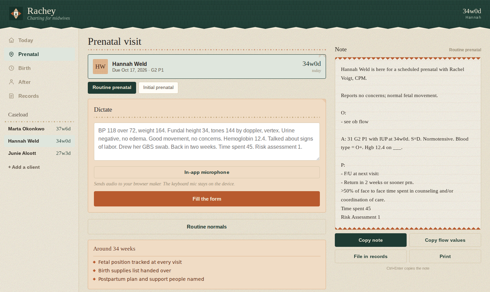

# Rachey

**Charting for midwives.** A local-first documentation app for a CPM practice —
prenatal visits, labor logging, postpartum and newborn notes — that runs
entirely in the browser and sends nothing anywhere.

## Why it works this way

Most charting tools solve the privacy problem with agreements. This one solves
it by architecture: there is no server to send anything to. The whole app is a
single HTML file. Notes are assembled by templates in the browser, not by a
language model, which is why it works offline, costs nothing to run, and never
transmits a patient detail.

That constraint drove every other decision, and it is the part worth keeping if
you fork this.

## Note types

Built to match Rachel's own Athena templates, so output pastes straight into
the assessment/plan section without reformatting.

| Note | Where |
|---|---|
| Routine prenatal | Prenatal tab, "Routine" |
| Initial prenatal | Prenatal tab, "Initial" |
| Postpartum | After tab, "Postpartum" |
| Well newborn | After tab, "Newborn" |
| Birth record | Birth tab, built from the labor log |

Two things to know about the output. **Objective data is deliberately not in
the note** — her templates say `O: - see ob flow` and `O: - see PE`, because
the numbers live in the Athena flow sheet. Vitals entered here drive the
assessment line and the threshold flags, then stay out of the note so nothing
gets duplicated. And the **CABC-required boilerplate is emitted verbatim every
time**: the pre-eclampsia warning list, the self-care line, and the `>50% of
face to face time` attestation. If any of that should vary by visit, those
lines need to become conditional.

The assessment line assembles itself: `A: 31 G2 P1 with IUP at 34w0d. S=D.
Normotensive. Blood type = O+. Hgb 12.4 on ___.` S=D is derived from fundal
height against gestational age, and an elevated BP replaces "Normotensive"
with the actual reading rather than asserting something untrue.

## The one thing to understand before deploying

**No clinical data ever reaches the server.** The server does exactly one job:
hand the browser a static HTML file. Everything Rachel enters lives in her
browser's `localStorage`, on her device, and nowhere else. There is no database,
no account system, no API call, and no analytics. The note text is assembled by
templates in the browser, not by a language model, which is why it works with
no signal and costs nothing to run.

Keep it that way. The moment you add sync, login, hosted backup, or AI note
polish, protected health information starts living on infrastructure you
control, and the whole HIPAA analysis changes.

## Dictation

Rachel can talk the visit instead of tapping it. Type or dictate into the box at
the top of the prenatal and postpartum forms, tap "Fill the form from this", and
a parser reads the text and sets the fields and chips. It then tells her exactly
what it picked up, and drops any sentence it did not recognise into the free
text box so nothing is silently lost.

The parsing is plain pattern matching in the browser. No model, no network, no
cost. It understands clinical shorthand ("BP 118 over 72, FH 34, tones 144 by
doppler, vertex LOA, urine negative, back in two weeks"), spoken numbers, and
negation, so "no headache" does not tick the headache box.

**On the microphone.** There are two ways to get speech into the box, and they
are not equivalent for privacy:

- **The keyboard microphone** (the mic key on the iPhone or Android keyboard).
  On recent iPhones this runs on the phone itself. Nothing is transmitted.
  This is the one to use.
- **The in-app microphone** button, which uses the browser's Web Speech API.
  In Chrome this streams the audio to Google's servers for transcription. That
  is a transmission of protected health information to a third party you have no
  agreement with. It is offered because it is convenient, and labelled in the
  interface, but it is the wrong default for clinical use.

If you ever want the in-app microphone gone entirely, delete the `micToggle` and
`micStop` functions and the `live` branch in `dictationCard`.

## Files

| File | Purpose |
|---|---|
| `index.html` | The entire app. Self-contained. |
| `manifest.json` | Makes it installable to the home screen. |
| `sw.js` | Service worker. Caches the app so it opens with no signal. |
| `icon-192.png`, `icon-512.png`, `apple-touch-icon.png` | Home screen icons. |
| `icon.py` | Regenerates the icons if the mark ever changes. |

## Deploying (free, about five minutes)

Any static host works. Three that cost nothing:

**Cloudflare Pages** — the easiest. Go to the Pages dashboard, choose "Upload
assets", drag this whole folder in, name the project. You get an HTTPS URL
immediately. Attach a custom domain later if you want.

**Netlify Drop** — visit app.netlify.com/drop and drag the folder onto the page.
No account needed to start.

**GitHub Pages** — push the folder to a repo, then Settings, Pages, and set the
source to the `main` branch root.

HTTPS is required. The service worker will not register over plain HTTP, and
without it there is no offline mode. All three hosts above give you HTTPS by
default.

## Installing it on her phone

**iPhone:** open the URL in Safari, tap the share button, then "Add to Home
Screen". It launches full screen with no browser chrome.

**Android:** open in Chrome, then "Install app" from the menu.

Once installed it opens offline. The footer reads "Saved for offline use" when
the service worker has finished caching.

## Shipping an update

Edit `index.html`, bump `CACHE = 'rachey-v1'` in `sw.js` to `v2`, and re-upload.
Phones pick up the new version on the next launch. Without the cache bump they
will keep serving the old copy from cache.

## Backups matter more than usual here

Local-only cuts both ways. Clearing browser data, losing the phone, or deleting
the installed app takes the records with it, and there is no copy on a server to
restore from. Records, then "Export a backup", writes a JSON file. Weekly is a
reasonable rhythm. "Restore from a backup" reads it back on any device.

## Scope

This is a drafting aid that produces text to copy into wherever the legal record
actually lives. It is not itself the legal record, and the threshold reminders
are memory prompts, not clinical guidance.

## Running it

Open `index.html` in a browser. That is the whole install.

To deploy: any static host works. Drag the folder onto Cloudflare Pages or
Netlify Drop, or push to a repo and enable GitHub Pages with the source set to
the branch root. HTTPS is required — the service worker will not register over
plain HTTP, and without it there is no offline mode.

Shipping an update: edit `index.html`, then bump `CACHE = 'rachey-v1'` in
`sw.js` to `v2` before re-uploading. Without the bump, browsers keep serving the
cached copy.

## Tests

Six suites, 212 assertions, run under jsdom. They cover the note templates, the
dictation parser, gestational-age arithmetic, the client hub, the live preview,
and date rollover. There is no build step and no test runner config — each suite
is a plain Node script.

## License

Not licensed for reuse. Published so the approach is visible, not as a template
to fork. Ask if you want to do something with it.
